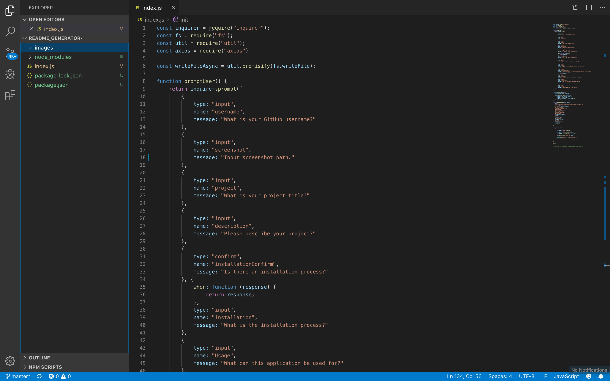

# README Generator
The user will be prompted for their GitHub username, which will be used to make a call to the GitHub API to retrieve their email and profile image. They will then be prompted with questions about their project.

## Table of Contents
- [Installation](#Installation)
- [Usage](#Usage)
- [Licensing](#Licensing)
- [Contribution](#Contribution)
- [Testing](#Testing)
- [Questions](#Questions)
## Installation 
NPM Install
## Usage
Generating READMEs
## Licensing
MIT
## Contribution
Fork the repository and then submit pull requests
## Testing
NPM Test
## Questions
null

    